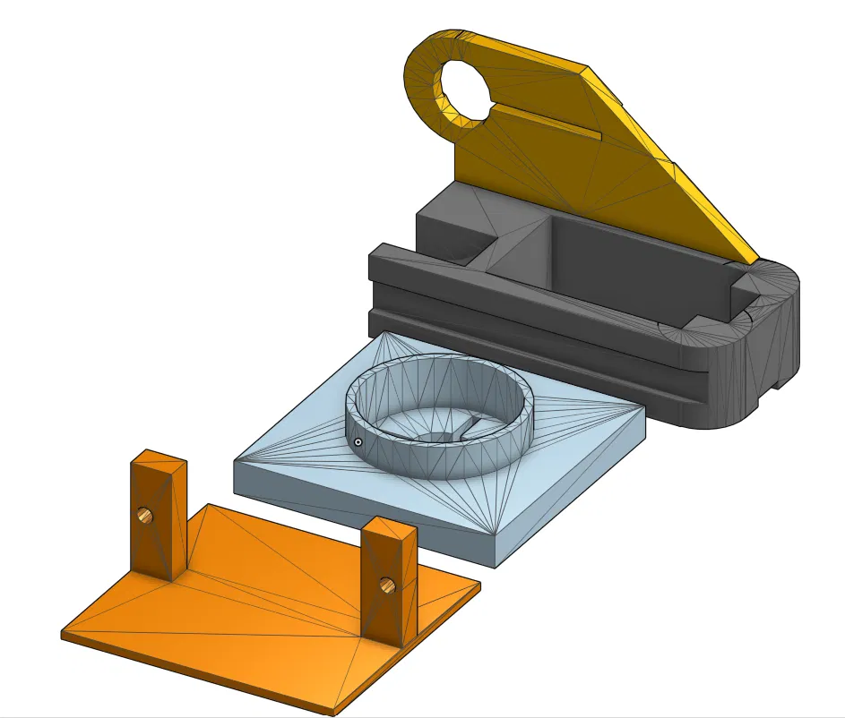

Project Overview:
This is a personal project building a pan-tilt laser tracking system. An ESP32-CAM captures visual data and calculates the (X, Y) coordinates of a target's movement, then sends that position to an Elegoo Uno, which translates it into servo commands. The servos move a pan-tilt bracket carrying the laser to track the target in real time.

My Role:
I'm designing and building this system on my own, from the power and communication architecture down to the pan-tilt mechanical assembly.

Design Process:
The system runs on three main components: the ESP32-CAM for vision processing, the Elegoo Uno for translating coordinates into servo signals, and a pan-tilt bracket that carries the laser itself. The Uno is powered by a 9V battery or wall adapter through its DC jack, with servos running off the Uno's 5V pin. The ESP32-CAM needs a separate power source, or a large capacitor across the power lines, to avoid voltage dips that could reset or damage it during operation.

Challenges & Solutions:
Two hardware problems stood out early on. First, the ESP32-CAM runs on 3.3V logic while the Uno operates on 5V, so connecting them directly would have burned out the camera over time. I solved this with a bi-directional logic level converter between the two. Second, the ESP32-CAM has no built-in USB port, so uploading code to it isn't as simple as plugging in a cable. I can either use an FTDI adapter, or temporarily turn the Uno itself into a programmer by bypassing its main chip and connecting the Uno's RESET pin to ground.

Outcome:
This project is still in progress. So far I've worked through the power delivery and logic-level conversion issues, and the pan-tilt mechanical design is built out in CAD. Next steps are finishing the servo-to-bracket integration and getting the full camera-to-servo pipeline working end to end.
